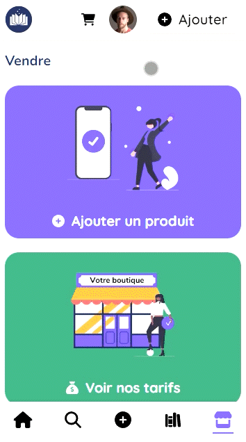
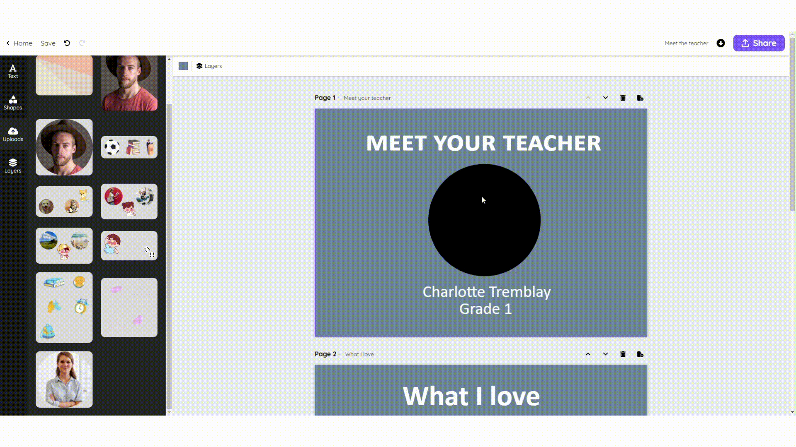
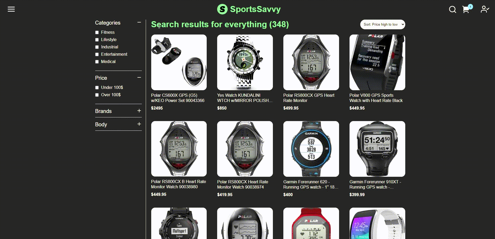
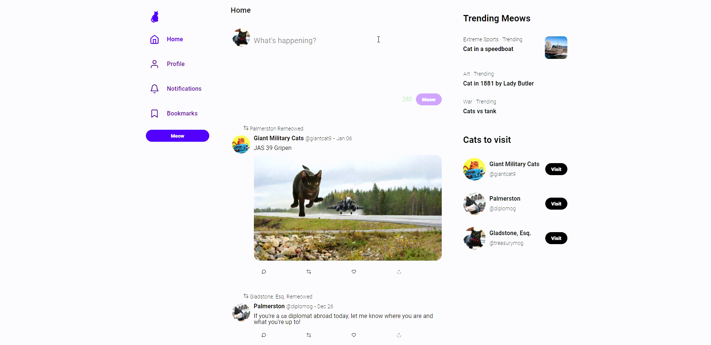

# Hello, folks! 

I'm a self-taught programmer with a passion for building things. I've been at it for over 2 years now, and along the way I started my own startup in the education sector. Excited to share my projects with you here on GitHub!

## 🚀 Projects

### Écolio | 👩‍🏫 Marketplace for Teachers

### Sketch | 🎨 Canva clone for Teachers

### SportsSavvy | 🏀 E-commerce for Sports Technologies - Team project

### Critter | 🐦 Twitter Clone

### Alien Shooter | 🎮 Game with JavaScript

## 🔧 Techologies & Tools

- Languages:
  
  

- Frontend:
  
  
  
  
  
  

- Backend:
  
  
  
  

- Tools:
  
  
  

<!-- ## 📈 GitHub Stats

 -->

## 📫 Connect with me

- [LinkedIn](https://linkedin.com/in/samuel-duhaime-morissette)
- <sduhaimemorissette@gmail.com>
